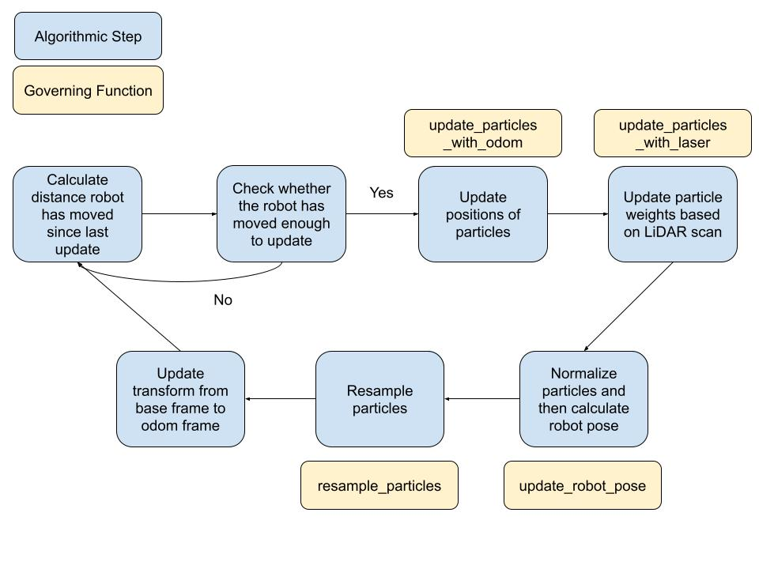
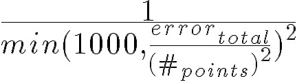
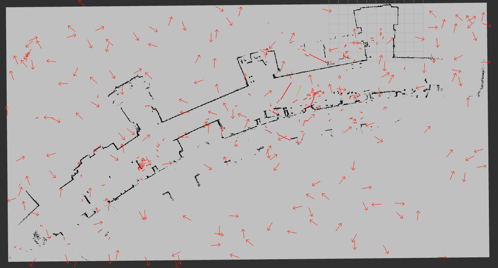
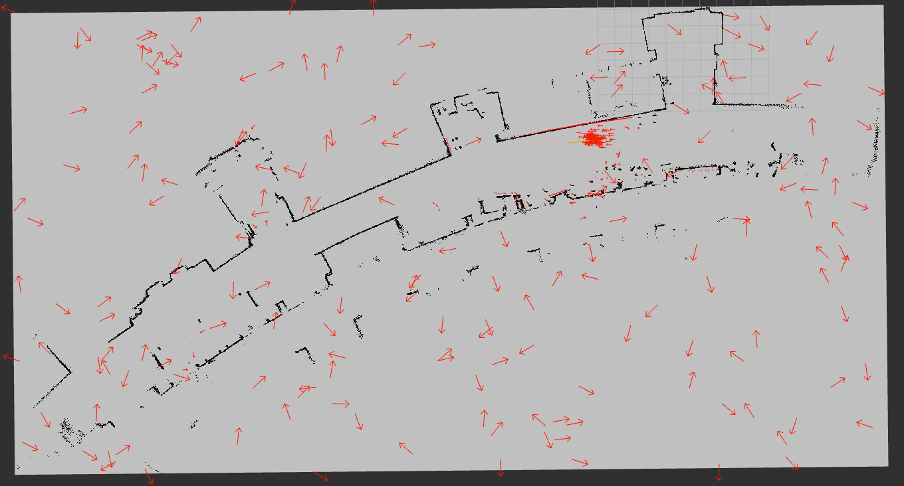
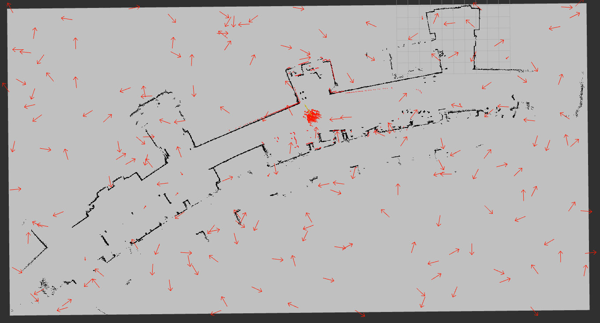

<!-----

You have some errors, warnings, or alerts. If you are using reckless mode, turn it off to see useful information and inline alerts.
* ERRORs: 0
* WARNINGs: 0
* ALERTS: 5

Conversion time: 1.403 seconds.

Using this Markdown file:

1. Paste this output into your source file.
2. See the notes and action items below regarding this conversion run.
3. Check the rendered output (headings, lists, code blocks, tables) for proper
   formatting and use a linkchecker before you publish this page.

Conversion notes:

* Docs to Markdown version 1.0β40
* Fri Oct 18 2024 09:44:07 GMT-0700 (PDT)
* Source doc: CompRobo Localization Writeup
* This document has images: check for >>>>>  gd2md-html alert:  inline image link in generated source and store images to your server. NOTE: Images in exported zip file from Google Docs may not appear in  the same order as they do in your doc. Please check the images!

----->

**Project Goal:**

The goal of this project was to, given a map of a world, localize a mobile robot within that world using information from the robot’s lidar sensor and odometry system. In order to achieve this goal, we implemented a particle filter algorithm that was able to localize the robot within its world with a reasonable amount of consistency. We tested our algorithm with different parameters and Gaussian noise thresholds to prove its efficacy despite these factors.

**How did you solve the problem? (Note: this doesn’t have to be super-detailed, you should try to explain what you did at a high-level so that others in the class could reasonably understand what you did).**

Our basic approach to implementing the particle filter algorithm was pretty straightforward. All of the primary logic for the particle filter was placed within the ParticleFilter class, and the logic of the particle filter was executed by the run_loop function within that class. The structure of our implemented algorithm and the functions that governed each step are shown below.

The real core of this algorithm lies in the middle four steps - updating particle positions, updating particle weights, calculating the robot’s position, and resampling the particles. These four steps will be described in greater detail below.

**Update particle positions**

This step takes in the poses of the previously resampled particles and the linear and angular distance traveled since the resampling (as determined by the on-board odometry), and outputs an updated set of particles. The new particle positions are calculated by adding the positional change in x, y, and theta returned by the odometry, which is already projected into the map frame. This leads to some issues whereby particles are able to strafe sideways and even move backwards. This primarily leads to faulty convergence whereby the particles are facing 180 degrees offset from the correct direction, but are still moving in the correct direction. However, given that the odometry is already projected into the map frame this cannot be avoided. 

In order to account for the inaccuracy in the robot’s on-board odometry, we added some noise to the distance the particles actually traveled. We first did this with entirely random noise before pivoting to a gaussian distribution, with the 3σ spread of the distribution controlled by the odom_lin_noise and odom_ang_noise variables. These values were set to 0.1 m and 0.02 rad respectively, which were assumed to be quite high compared to the actual expected values.

**Update particle weights**

This step takes the particle poses determined in the previous step and the current laser scan, and gives each particle a weight corresponding to how likely that particle is to be the actual position of the robot. 

In order to do this, we first threw out all non-finite data points from our laser scan. For each remaining data point, we then determined where it fell on our map (assuming our robot was located at our particle’s pose), and added a small amount of sensor noise, which was sampled from a normal distribution with its standard deviation controlled by the laser_range_noise variable (3σ spread set to 0.1 m). We then found the distance between the laser measurement point and the closest obstacle on the map with the occupancy grid (filtering non-finite values) and added it to the total error value. We then found the weight of each particle as

This division by the number of points was necessary to prevent the particles from inherently preferring the edges of the map in order to minimize cost (which would place most laser scan data points off the map and lead to a lower error total). Squaring points to further incentivize positions with more visible data further helped and then squaring the denominator made the total weighting more skewed towards particles that match very well. This allowed us to push the resampling percentage much lower and increase stochastic exploration, leading to faster average conversion.

**Calculate robot pose**

We decided to calculate our mean pose as a weighted average of the top echelon of particles. In order to do this, we determined a proportion of particles to use for our pose. We decided on the top 3.5% (stored in the pose_proportion variable) because we were resampling as low as 30% total and further had to account for the variations in stochastic noise added to the particles after resampling. We believed that 3.5% would be a reasonable proportion of particles that match the convergence resampling and are not overly corrupted by the noise. To achieve this, we ordered all particles by weight, and calculated a weighted average of the top echelon. 

**Resample particles**

In our resampling, we decided to do a combination of weighted resampling (based on our particle weights) and random sampling in order to prevent particle death. We controlled this parameter with our resample_proportion variable. We performed our weighted resampling using our particle weights and the draw_random_sample helper function. We performed our random sampling using the random_particle function. We were not able to reliably bound the random particles to the interior of the map due to a lack of differentiation between particles inside and outside the floorplan. We found that the algorithm worked with a resample_proportion as low as 0.3, corresponding to only 30% resampling by weight and 70% random. There is a balance between resampling and stochastic exploration, whereby a perfect balance will lead to faster average convergence. If the resampling proportion is too low, convergence will never happen or be very short-lived. If the resampling proportion is too high, convergence will occur quickly, but likely in the wrong area and then the algorithm will struggle to find the correct convergence. We also added some noise to our resampled particles to prevent over-convergence, which was sampled from a gaussian distribution governed by the resample_lin_noise and resample_ang_noise variables (0.5 m and 0.1 rad, 3σ spread respectively).

**Describe a design decision you had to make when working on your project and what you ultimately did (and why)? These design decisions could be particular choices for how you implemented some part of an algorithm or perhaps a decision regarding which of two external packages to use in your project.**

The largest decision we made in this project was performing our resampling with such a high proportion of stochastic exploration. We realized that particle death was our main danger, especially with a floor plan that is so symmetrical. So, we designed the rest of the algorithm and weighting in order to provide a very strong lock on good convergences so that it would stick to good guesses. We also made the robot pose calculations be only based on the highest echelon of particles. In total, these decisions permitted us to do this stochastic exploration without confusing the algorithm in situations where it had already converged and without leading to instabilities in the pose. This decision proved pivotal in a lot of situations especially with how few particles we actually had on the map. We had a lot of very poor starts that only were resolved through a reconvergence due to exploration. 

**What if any challenges did you face along the way?**

The biggest challenge that we faced was trying to weigh the laser scans properly because it required understanding the occupancy grid and how to appropriately apply the algorithm. Even when we had the correct algorithm, it was hard to deduce this because as we discovered, the way weights were calculated and the amount of random noise on the resampling greatly affected the results. We first got it working by setting the weighting to almost all-or-nothing where only the closest one or two particles were actually weighted highly, which proved desirable behavior in their convergence.

**What would you do to improve your project if you had more time?**

One thing we would do to improve our project would be to implement the algorithm on a physical Neato robot. We attempted to do this, but had little success, and were unable to troubleshoot effectively due to issues with our rviz setup. With more time, we would hopefully be able to fix the visualizations and modify the algorithm to work effectively on a physical robot. Another improvement we could make is to make our visualizations more appealing. We chose to focus our time on other parts of the project, such as our sensor and odometry models, which left us with visualizations that were effective for troubleshooting but not very visually appealing, but functional. One bug we had was that the stochastic exploration particles displayed at a very large weight compared to the resampled particles, completely unrelated to their actual magnitudes.

**Did you learn any interesting lessons for future robotic programming projects? These could relate to working on robotics projects in teams, working on more open-ended (and longer term) problems, or any other relevant topic.**

One important lesson we learned was the importance of cross-referencing and double-checking that commands are implemented correctly. One of our team members spent the better part of a week trying to troubleshoot a problem that occurred only because he forgot to include “--clock” at the end of a bash command when running the particle filter. The other member didn’t bother checking the command since he thought that Ctrl+C and Ctrl+V are not possible to do incorrectly.

Another lesson we learned was that at the very end we realized that the odometry update we created had led to the backwards-driving convergence since we hadn’t transformed the odometry update to the particle reference frame. However, given that it was already in the map frame this transformation would not have worked anyway. We accidentally implemented the right thing without understanding why. We saw that the particles moved in the expected directions, but did not consider that them moving like that was an abstraction from the robot frame. This probably could have been avoided through a more thorough understanding of the original codebase before jumping into the project.
